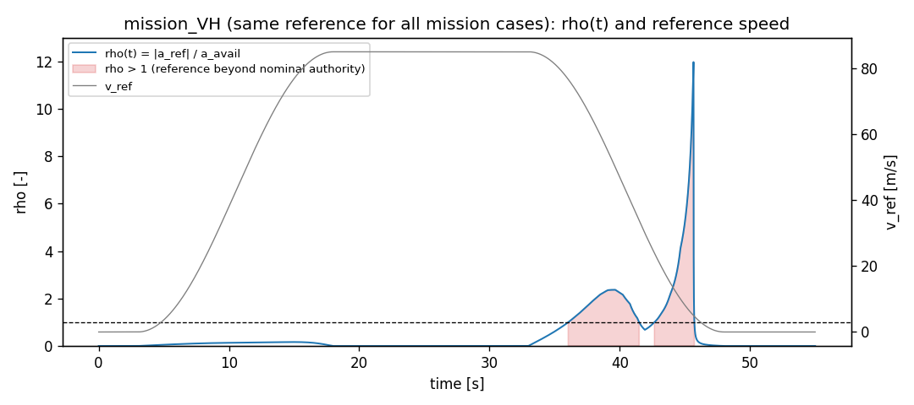

# 임무 ρ(t) — ρ > 1 구간과 나머지 구간(SMOKE)

**SMOKE** — kj 결정(2026-09-26 저녁): 임무 감속 프로필은 유지하고 ρ > 1 구간을 분리해 보고한다. 우위 결론 없음.

재현: `python -m control.arena_mission_rho --runs results/validation/arena_20260926T074209129719Z` · 설정 sha256 `19cd72375ef7` · git `16b32deb2a7299db7714b2d4749396b6880f2bce` dirty=True · 스모크 실행 arena_20260926T074209129719Z

ρ(t) = |a_ref| / a_avail(v_ref, 방향). a_ref는 경기장 창과 같은 0.05 s 전진 차분이다. a_avail은 명목 모델이 추력 ≥ 0·역유입 없이 낼 수 있는 최대 가·감속(참조 프로필 ρ와 같은 정의)이다. 구간은 평가 창(3 s부터) 안에서 나눈다. 칸의 "비행 s / 전체 s"는 그 구간 중 시행이 멈추기 전까지 난 시간이다.

## mission_VH

ρ > 1 구간: 36.0–41.5, 42.7–45.7 s(평가 창 안 8.5 s, 나머지 43.5 s), ρ 최대 11.98

| 제어기 | 정지·시간 s | ρ > 1: 비행 s / 전체 s | RMSE v | RMSE z | 최대 고도오차 | \|ω\|max | 나머지: 비행 s / 전체 s | RMSE v | RMSE z | 최대 고도오차 | \|ω\|max |
|---|---|---|---:|---:|---:|---:|---|---:|---:|---:|---:|
| V13 | 끝까지 | 8.5 / 8.5 | 5.11 | 0.716 | 1.98 | 13.7 | 43.5 / 43.5 | 0.145 | 0.0337 | 0.57 | 1.8 |
| M17 | 36.60 정지 | 0.6 / 8.5 | 0.796 | 0.0185 | 0.0301 | 0.225 | 33.0 / 43.5 | 0.148 | 0.0419 | 0.103 | 0.21 |
| F13 | 끝까지 | 8.5 / 8.5 | 2.45 | 0.882 | 3.01 | 9.84 | 43.5 / 43.5 | 0.0546 | 0.0325 | 0.234 | 0.983 |
| GSLQR | 46.11 정지 | 8.5 / 8.5 | 9.2 | 13.3 | 23.7 | 2.8 | 34.6 / 43.5 | 3.06 | 3.25 | 20.6 | 35.1 |

## mission_VH_mass1.3

ρ > 1 구간: 36.0–41.5, 42.7–45.7 s(평가 창 안 8.5 s, 나머지 43.5 s), ρ 최대 11.98

| 제어기 | 정지·시간 s | ρ > 1: 비행 s / 전체 s | RMSE v | RMSE z | 최대 고도오차 | \|ω\|max | 나머지: 비행 s / 전체 s | RMSE v | RMSE z | 최대 고도오차 | \|ω\|max |
|---|---|---|---:|---:|---:|---:|---|---:|---:|---:|---:|
| V13 | 끝까지 | 8.5 / 8.5 | 4.6 | 0.952 | 2.81 | 14.2 | 43.5 / 43.5 | 0.307 | 0.183 | 0.285 | 6.63 |
| M17 | 36.12 정지 | 0.1 / 8.5 | 0.139 | 0.402 | 0.407 | 0.132 | 33.0 / 43.5 | 0.0905 | 0.297 | 0.435 | 0.192 |
| F13 | 39.90 정지 | 3.9 / 8.5 | 3.68 | 2.62 | 4.58 | 9.97 | 33.0 / 43.5 | 0.103 | 0.216 | 0.263 | 0.668 |
| GSLQR | 44.55 정지 | 7.3 / 8.5 | 17 | 13.3 | 50 | 22.8 | 34.2 / 43.5 | 1.85 | 1.24 | 9.88 | 24.5 |

## mission_VH_tau2

ρ > 1 구간: 36.0–41.5, 42.7–45.7 s(평가 창 안 8.5 s, 나머지 43.5 s), ρ 최대 11.98

| 제어기 | 정지·시간 s | ρ > 1: 비행 s / 전체 s | RMSE v | RMSE z | 최대 고도오차 | \|ω\|max | 나머지: 비행 s / 전체 s | RMSE v | RMSE z | 최대 고도오차 | \|ω\|max |
|---|---|---|---:|---:|---:|---:|---|---:|---:|---:|---:|
| V13 | 32.91 정지 | 0.0 / 8.5 | — | — | — | — | 29.9 / 43.5 | 26.8 | 7.96 | 18.6 | 35 |
| M17 | 36.56 정지 | 0.5 / 8.5 | 0.723 | 0.017 | 0.0282 | 0.267 | 33.0 / 43.5 | 0.144 | 0.0422 | 0.103 | 0.21 |
| F13 | 21.14 정지 | 0.0 / 8.5 | — | — | — | — | 18.1 / 43.5 | 5.92 | 0.405 | 1.65 | 16.1 |
| GSLQR | 46.15 정지 | 8.5 / 8.5 | 9.21 | 13.3 | 23.7 | 3.08 | 34.6 / 43.5 | 3.08 | 3.26 | 20.6 | 35.4 |

